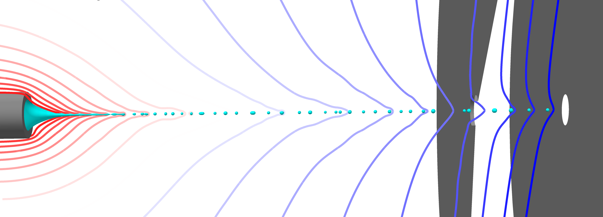
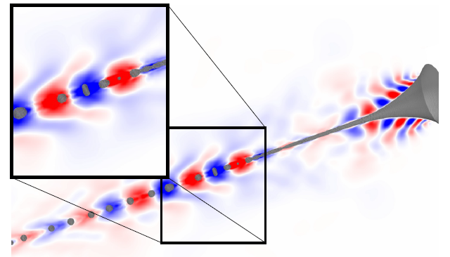

# High-Resolution Two-Phase Electrohydrodynamic Solver for OpenFOAM

This repository hosts a solver implemented in OpenFOAM v1912 for simulating two-phase electrohydrodynamic (EHD) flows with high resolution, focusing on Taylor cone jet dynamics. The solver is based on the interIsoFoamEHD solver and incorporates the isoAdvector interface capturing method to ensure precise representation of fluid interfaces. It is capable of simulating systems involving two immiscible mediums with low conductivities.

## Features:

- **Two-phase Flow Simulation**: Capable of simulating the dynamics of two-phase flows, such as liquid-gas or liquid-liquid systems.
- **Electrohydrodynamics (EHD)**: Incorporates EHD effects to account for the influence of electric fields on fluid flow and particle motion.
- **High Resolution Interface Capture**: Utilizes the isoAdvector method for high-resolution interface capturing, ensuring accurate representation of fluid interfaces and minimizing numerical diffusion.
- **Taylor Cone Jet Dynamics**: Focused on simulating the dynamics of Taylor cone jets, a common phenomenon in electrohydrodynamics.
- **Automatic Mesh Generation**: Provides both automatic 2D axisymmetric and full 3D mesh generation with SnappyHexMesh in the tutorial folder.
- **Custom Solvers and Library**: Includes the interIsoFoamEHD solver in the `model/applications/solvers` folder and a library for immiscible two-phase flow in the `model/src/` folder.

## Cases of Study

| Test Case       | Abstract Image                                   |
|------------------|-----------------------------------------|
| [Base Taylor Cone 2D Axissymmetric](taylor-cone-jet-EHD/Taylor-Cone-Jet-2D)            |   |
| [Multi-Stage Axial Acceleration](taylor-cone-jet-EHD/multi-stage-jet)            | |
| 3D Whipping Dynamics of EHD Jets  (soon)          | |
| POD/DMD of EHD Fields  (soon)          | |
| 3D Atomization of Liquid EHD Jets  (soon)          | |

## Directory Structure:

- **model/**
  - (source files for the interIsoFoamEHD solver)
  - **applications/**
    - **solvers/**
      - **interIsoFoamEHD/**
  - **src/**
    - **libimmiscibleIncompressibleTwoPhaseEHDMixture/**

- **Taylor-Cone-Jet-EHD/**
  - **2D_axisymmetric/**
    - **case_files/**
    - **system_files/**
  - **3D_mesh/**
    - **case_files/**
    - **system_files/**
  - (other tutorial cases)
 
## Simulation of Taylor Cone Jets

Automated script using .m4 files to generate a 2D axis-symmetric or Full 3D simulation of a Taylor Cone Jet

### Overview
+ Template case for axisymmetric EHD jet flow
+ Template case for Full 3D EHD jet flow
+ The main purpose of this template is to demonstrate a simple, reliable meshing
  strategy for axisymmetric flow
+ These templates are intended to run with the solver interIsoFoamEHD!

+ ## Usage:
1. Clone this repository to your local machine.
2. Compile the solver using the provided build scripts.
3. Prepare your case setup, including mesh generation and boundary conditions.
4. Run the simulation using standard OpenFOAM utilities.
5. Post-process the results using visualization tools compatible with OpenFOAM. (Try our python scripts!)

### Meshing of the 2D Axisymmetric
+ The blockMeshDict file contains a backgroundMesh subditionary
+ In backgroundMesh set the geometry radius and length and jet radius
+ Set the number of cells in the length and radial directions
+ Run blockMesh to generate a 2D "domain" mesh
+ Run extrudeMesh to convert the mesh into a 2D axisymmetric mesh with wedge
  front and back patches

### Initialisation
+ In the field files in the 0 directory, set inlet values
+ For example, in 0/U, set the inlet velocity Uinlet
+ Set the electrohydrodynamic properties in constant/transportProperties

### Output
+ Graph data of field values along the centreline are written to files in
  postProcessing/graph

## Cite
[1] S. Cândido, J. C. Páscoa, On modal decomposition as surrogate for charge-conservative EHD modelling of Taylor Cone jets, International Journal of Engineering Science, 2023. https://doi.org/10.1016/j.ijengsci.2023.103947 \
[2] S. Cândido, J. C. Páscoa, Dynamics of three-dimensional electrohydrodynamic instabilities on Taylor cone jets using a numerical approach, Physics of Fluids, 2023. https://doi.org/10.1063/5.0151109 \
[3] S. Cândido, J. C. Páscoa, Numerical Simulation of Electrified Liquid Jets Using a Geometrical VoF Method, International Mechanical Engineering Congress and Exposition, Virtual, Online. 2021 https://doi.org/10.1115/imece2021-69817 

## Contribution:
Contributions to this project are welcome! Whether it's bug fixes, enhancements, or new features, feel free to submit pull requests or open issues to discuss potential improvements.

## Authors:
This solver was developed by Sílvio Cândido and José C. Páscoa under the academic supervision of the University of Beira Interior, with support from the C-MAST Center for Mechanical and Aerospace Science and Technologies and the FCT Portuguese Foundation for Science and Technology.

## License:
This project is licensed under the [MIT License](LICENSE), allowing for both personal and commercial use with proper attribution.

